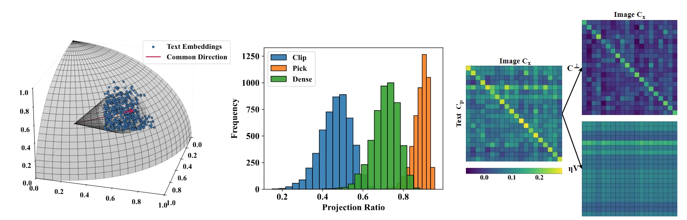
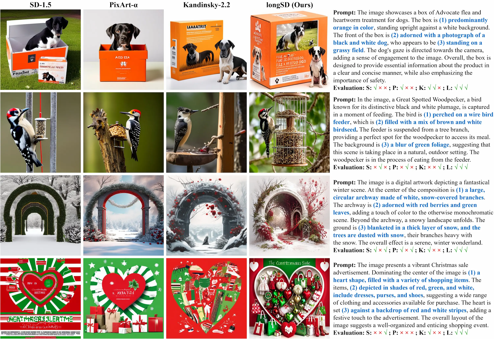
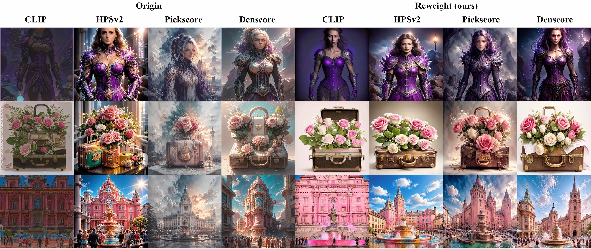

# Improving Long-Text Alignment for Text-to-Image Diffusion Models

This repo is the official PyTorch implementation for [Improving Long-Text Alignment for Text-to-Image Diffusion Models (LongAlign)](https://arxiv.org/abs/2410.11817)

by [Luping Liu](https://luping-liu.github.io/)<sup>1,2</sup>, Chao Du<sup>2</sup>, Tianyu Pang<sup>2</sup>, Zehan Wang<sup>2,4</sup>, Chongxuan Li<sup>3</sup>, Dong Xu<sup>1</sup>.

<sup>1</sup>The University of Hong Kong; <sup>2</sup>Sea AI Lab, Singapore; <sup>3</sup>Renmin University of China; <sup>4</sup>Zhejiang University


## What does this work do?

To improve long-text alignment for T2I diffusion models, we propose **LongAlign**, which features a **segment-level encoding** method for processing long texts and a **decomposed preference optimization** method for effective alignment training. For decomposed preference optimization, we find the preference models can be decomposed into two components: a text-relevant part and a text-irrelevant part. We propose a reweighting strategy that assigns different weights to these two components, reducing overfitting and enhancing alignment.


### CLIP-based preference decomposition

- (a) Schematic results for text embeddings. (b) Statistics of the projection scalar $\eta$ for three CLIP-based preference models. (c) The relationship between the original preference score and the two scores after decomposition.


### Generation result

- Generation results using our LongAlign and baselines. We highlight three key facts for each prompt and provide the evaluation results at the end.


- Generation results using different preference models, with and without our reweighting strategy.



## How to run the code?

### Prepare environment

```bash
pip install -r requirements.txt
# if you encounter an error with LoRA, please run `pip uninstall peft`
```


### Prepare dataset and checkpoint

- 2 million long-text & image dataset (the raw images need to be downloaded separately): https://huggingface.co/datasets/luping-liu/LongAlign 
- Stable Diffusion v1.5 (this will download automatically): https://huggingface.co/stable-diffusion-v1-5/stable-diffusion-v1-5
- T5-adapter (please download this to `./model/LaVi-Bridge`): https://huggingface.co/shihaozhao/LaVi-Bridge/tree/main/t5_unet/adapter 
- Denscore (this will download automatically): https://huggingface.co/luping-liu/Denscore
- longSD (please download this to `./model/longSD` or train them yourself): https://huggingface.co/luping-liu/LongSD


### Sample with Long Stable Diffusion

```bash
# First, run `huggingface-cli login`
# The model/longSD directory looks like: s28750_adapter, s28750_lora_vis.pt, sd15-reward-3750.pt
python3 sample.py --prompt "xxx"
```

### Train original Stable Diffusion

```bash
# support long-text inputs
bash run_unet.sh align ct5f
# please move {args.output_dir}/s{global_step_}_lora_vis.pt --> {args.output_dir}/lora_vis.pt and so on

# preference optimization for long-text alignment
bash run_unet.sh reward test
```

### Train LCM-version Stable Diffusion

```bash
# support LCM sampling
bash run_unet.sh lcm ct5f

# preference optimization for long-text alignment
bash run_unet.sh reward_lcm test
```


## References

If you find this work useful for your research, please consider citing:

```bib
@article{liu2024improving,
      title={Improving Long-Text Alignment for Text-to-Image Diffusion Models}, 
      author={Luping Liu and Chao Du and Tianyu Pang and Zehan Wang and Chongxuan Li and Dong Xu},
      year={2024},
      journal={arXiv preprint arXiv:2410.11817},
}
```

This code is mainly built upon [diffusers](https://github.com/huggingface/diffusers) and [LaVi-Bridge](https://github.com/ShihaoZhaoZSH/LaVi-Bridge) repositories, which you might also find interesting.
